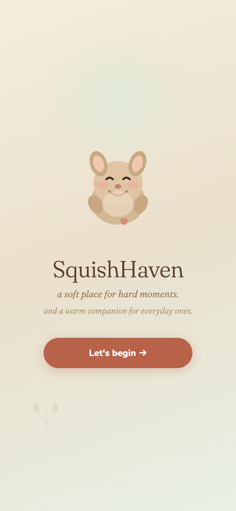
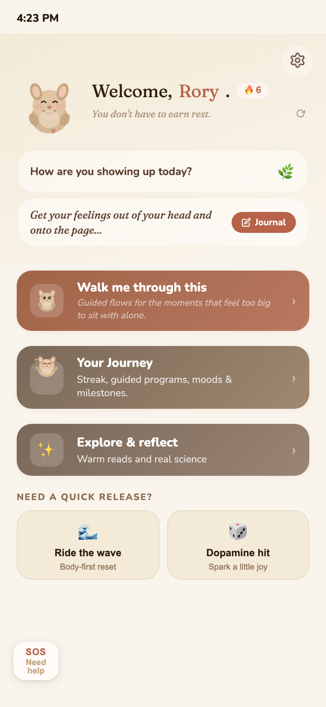
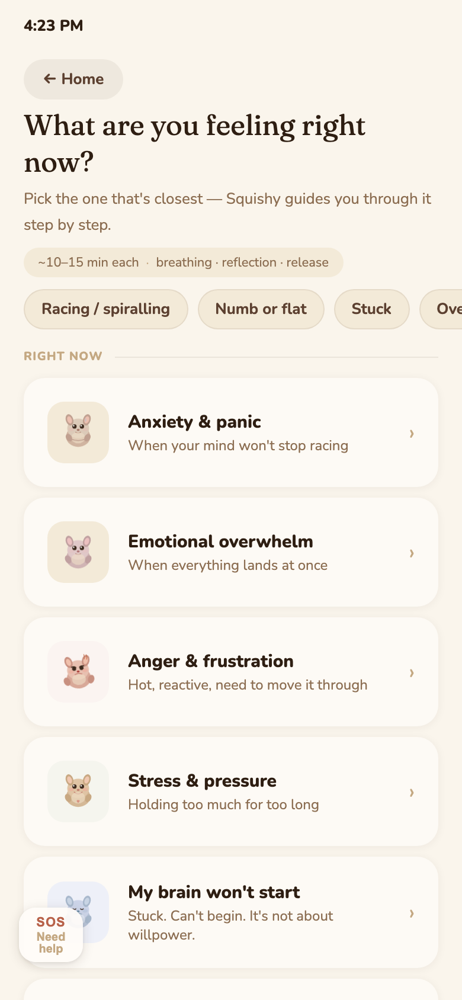
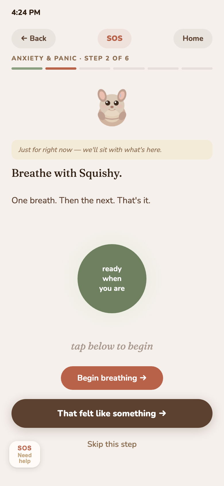
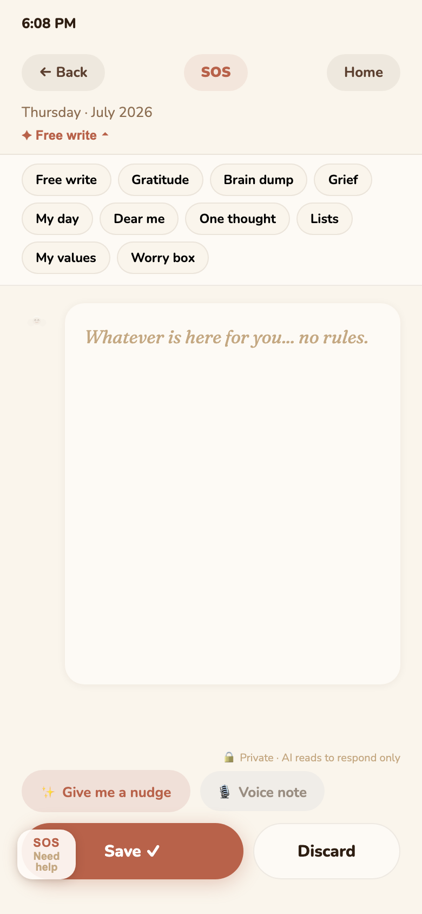
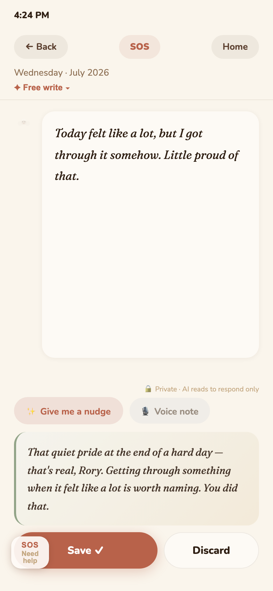
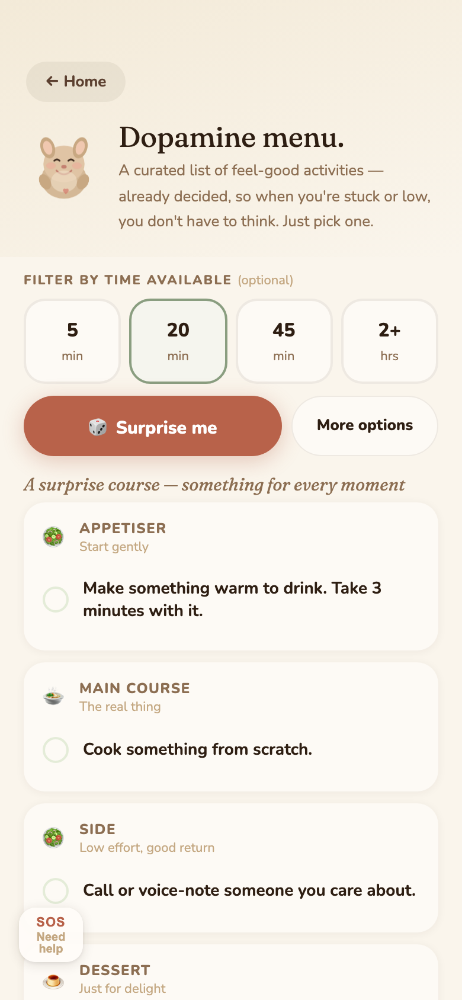
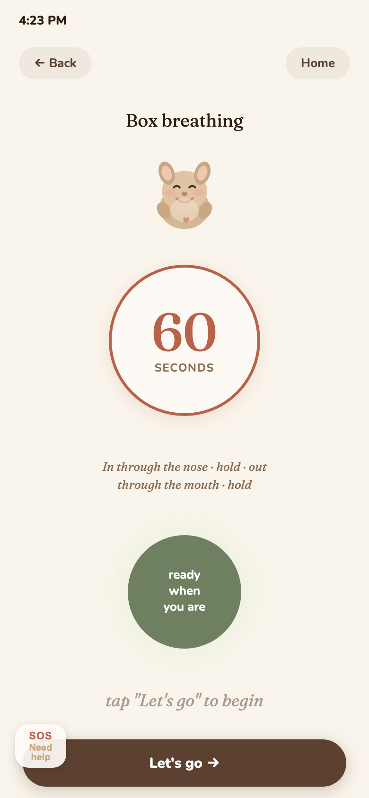
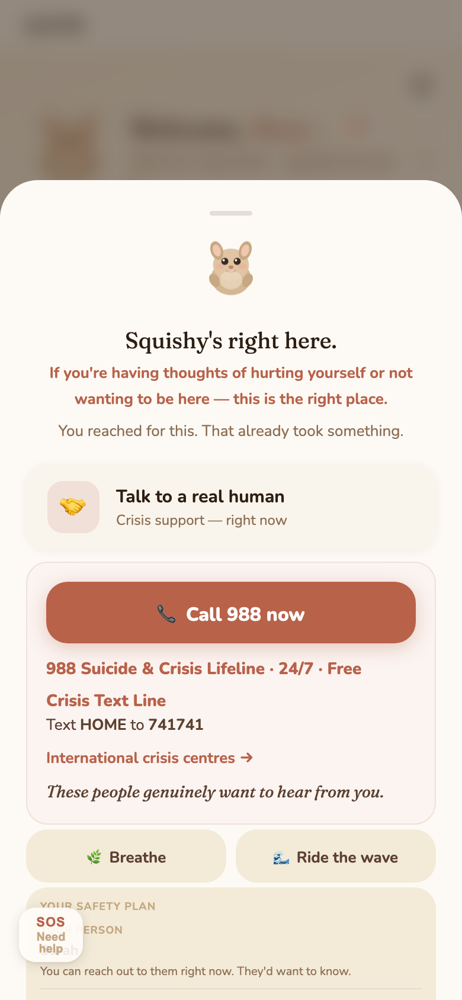

# SquishHaven — A Soft Place for Hard Moments

**A mental wellness companion built end-to-end, independently, using AI-assisted development.**
**Live:** https://squish-haven.vercel.app

  
  

---

## Quick Scan

- **What it is:** A mobile-first PWA for everyday emotional difficulty — guided support, somatic regulation, journaling — with crisis support always one tap away if things get worse
- **Who it's for:** Adults navigating everyday emotional difficulty — whether that's a 60-second physical reset when it's too much right now (Wave), a step-by-step walkthrough of a specific feeling (guided flows), a quiet place to think it through with a companion who responds (journal + AI), or a longer habit to build over days (guided programs)
- **My role:** End-to-end — product strategy, UX design, content writing, architecture direction, QA, deployment
- **Stack:** React + Vite, Supabase (auth, Postgres, Edge Functions), Claude AI, Vercel
- **Built with:** AI-assisted development (Claude for strategy/content/planning, Claude Code for implementation)

  
  

---

## 1 — Why I Built This

I built this while working through my own stretch of slow, unglamorous self-improvement — the kind you do in whatever pockets of energy you have left. Along the way I went through a lot of what's already out there: mood trackers, guided meditation apps, and more doomscrolling than I'd like to admit when none of it actually helped.

A few specific things kept showing up. Mood trackers ask you to log a feeling and then do nothing with it — no response, no acknowledgment, just a number added to a chart nobody looks at twice. Guided meditations assume you're already calm enough to sit still for twenty minutes, which isn't where you are at 2am with your chest tight. And crisis resources, on the rare app that includes them, tend to live on one static page you'd have to already know to go looking for — not something that shows up when the bad moment actually starts.

People in a hard moment don't want a dashboard — they want to feel met.

That's the gap SquishHaven is built for. Not a therapy replacement — a companion.

---

## 2 — The Vision

> *"A soft place for hard moments."*

The mascot — Squishy, a soft quokka — embodies the product's whole personality: gentle, non-judgmental, always there. The app adapts to a user's chosen support style (gentle companion / active support / just exploring), and just as importantly, to what they actually have capacity for in the moment — a 60-second release when there's no time or energy for anything more, a full guided flow when there's room to sit with something, or a multi-day program when the goal is to build a habit rather than get through a moment.

**North star:** Someone having a hard night should be able to open this, feel less alone within 2 minutes, and know exactly where to go if things get serious.

---

## 3 — Who It's For

**Primary user:** Adults navigating everyday emotional difficulty — anxiety, grief, burnout, low mood, ADHD-related overwhelm, self-criticism. Someone having a rough Tuesday, most of the time — not necessarily a crisis.

**Secondary consideration:** Users who *may* reach crisis. Safety is designed in from the very first screen, before any other feature.

**Not for:** Diagnosed clinical conditions requiring professional care — the app is upfront about that limit.

---

## 4 — What Was Built

| Feature | Why it exists |
|---|---|
| **14 guided flows** | Structured emotional support across four groups: **core emotions** (anxiety, overwhelm, anger, stress), **ADHD** (stuck/can't start, emotional spike, shame spiral), **grief & connection** (grief, loneliness, burnout), **self & mood** (self-criticism, low mood — numb / pointless / today). Each flow has multiple content variants, so returning users don't get the same experience twice. |
| **20 Wave exercises** | Somatic regulation across movement, grounding, breathwork, and mindfulness — for when talking or thinking isn't enough and the body needs to lead. |
| **9-category journal** | Free write, gratitude, brain dump, grief, my day, one thought (with a built-in CBT thought-record structure), lists, values, worry box — plus voice input and an AI companion response. Private, always. |
| **SOS overlay** | Persistent, one tap from any screen. Direct 988 call, grounding tools, and the user's own saved safety plan. Never buried behind a menu. |
| **Safety plan** | Written in the user's own words when calm — warning signs, personal anchors, a trusted contact, and personal reasons — surfaced back to them inside the SOS overlay when it matters most. |
| **AI companion (Squishy)** | AI-guided reflections that respond to what you write — warm, in the moment, never clinical. Appears inline in journal and flow steps. |
| **6 guided programs** | Multi-day structured tracks (5–10 days each): Breaking self-criticism, Anxiety toolkit, Gratitude practice, Grief wave, Softer inner voice, Finding meaning. Each day builds on what you shared the day before, so it feels like an ongoing conversation rather than a checklist. |
| **My Journey** | Streak tracking, this-week mood chart, and guided-program progress at a glance. |

  
  

---

## 5 — Product & Design Thinking Applied

Some of these calls are backed by more than instinct — research on wellness apps backs it up too.[^1] Most people who download a wellness app stop using it almost immediately, and the same research points at specific causes: gamified features tend not to help retention (and can hurt it), while human-feeling support does; cluttered navigation and too many features are the top reasons people abandon an app fast. That's the backdrop behind skipping gamification entirely, keeping the AI companion warm instead of clinical, and never letting a single screen get crowded.

**Safety comes before polish.** The SOS button sits on every single screen — mid-flow, mid-journal, mid-program. That costs a little visual real estate everywhere, permanently. I kept it anyway: the alternative is someone needing help and having to hunt for where to tap.

**Not every hard moment needs the same amount of you.** Sometimes there's five minutes and zero patience for reflection — that's what Wave is for, a physical reset in under a minute, no thinking required. Sometimes there's room to actually sit with something — that's a guided flow. And sometimes the goal isn't getting through today at all, it's building something over time — that's what the multi-day programs are for. Same person, same app, three completely different asks depending on what's actually available that day.

**How the app talks matters as much as what it says.** Every screen is written in plain, experiential language — *"my brain feels different today"* instead of "ADHD symptoms" — so someone can recognize themselves in it without being handed a clinical label they didn't ask for. That same instinct shapes the ADHD flows: instead of treating "ADHD" as one bucket, it forks by how it actually shows up — stuck and unable to start, an emotional spike, or a shame spiral afterward — three different experiences, three different entry points, instead of one generic button.

Every flow follows the same consistent shape, so returning users always know what to expect. What fills each step rotates, so someone coming back to the same flow a second or third time isn't reading the same script again.

Squishy responds to what you wrote — it never tells you what to do. Responses stay warm but scoped, with no clinical guidance or diagnosing. That was a liability call as much as a product one, made on purpose from the start.

Journal entries are encrypted on your device from the very first build.

---

## 6 — How It Was Built

**Role:** End-to-end ownership — product strategy, UX design, content writing, architecture direction, QA, and deployment.

**Approach:** AI-assisted development. Product direction, emotional content, UX decisions, and prioritization calls were mine throughout; Claude Code accelerated the implementation layer, and Claude (this conversation) handled strategy, planning, and writing.

**Stack:**
- React + Vite (frontend shell)
- Supabase — auth (Google OAuth + magic link), Postgres, Edge Functions
- Claude AI via Supabase Edge Function — powers the AI companion
- Vercel — hosting
- Custom CSS design system — no UI framework

**Data approach:** Offline-first. The app works fully from localStorage on a slow or missing connection; Supabase sync happens in the background and is fire-and-forget, so nothing blocks the UI while waiting on a network call.

---

## 7 — What I'd Do Differently

**I built milestones, then cut them back.**
Early on, I built out full dynamic milestone tracking for My Journey — badges that unlock from real usage ("first entry," "5-day streak," "10 sessions"), calculated live rather than hardcoded. Once it was live alongside check-in history and flow reflections, the screen felt cluttered rather than motivating — too much competing for attention on a screen meant to feel like quiet progress, not a stats dashboard. I cut it back to streak, this week's mood, and program progress only. The rest didn't get deleted — it's parked, commented out, ready to reintroduce once there's a clearer design for surfacing it without the clutter. In hindsight, I'd want a lighter version of that screen validated before building the fuller one — the milestone logic itself was good work, it just arrived on the page before I knew whether the page wanted it.

**Content repetition — a flaw I only found by using my own product.**
The first version of flow and journal-prompt content picked randomly from a pool every time, with no memory of what a user had already seen. It technically worked, but it quietly broke a principle I cared about: someone returning to the same anxiety flow a few days later would see nearly the same exercises and prompts, which reads as robotic, not caring. I went back and rebuilt it so content rotates properly and doesn't repeat on return visits, across all 6 multi-day programs too. Next time, this is something I'd design in from day one instead of catching it after the fact.

---

## 8 — What I Learned

**On product:**
- Safety features have to be designed in from the first screen — retrofitting them later is where they get cut for time
- "Warm and non-clinical" is much harder to write consistently than it sounds — nearly every line of copy got at least one rewrite
- People in distress don't read carefully — hierarchy and immediacy beat completeness, every time

**On building:**
- AI-assisted development raises the speed ceiling, but you still need to know exactly what to build and why — I saw that firsthand every time a docs claim turned out not to match the actual code
- Shipping something imperfect and live taught me more than another month of polishing on my laptop would have
- I'm equally interested in the architecture decision and the copy on a button — that combination is what I want more of in whatever I build next

**On the pivot:**
- The audit instinct — don't trust the summary, verify against the source — transferred directly. The same discipline that catches a misstatement in a control test caught real gaps in this app's own documentation more than once during this build

---

## 9 — What's Next

- User testing with people outside my own network
- Native iOS/Android via a Capacitor wrapper

---

*— BAM, 2026*

[^1]: Retention figures and gamification findings from published mental-health-app research: [Fleming et al., wellness app retention meta-analysis](https://www.frontiersin.org/journals/psychiatry/articles/10.3389/fpsyt.2022.900615/full); [meta-analysis of 79 RCTs on adherence](https://www.ajmc.com/view/addressing-uptake-adherence-and-attrition-in-mental-health-apps).
